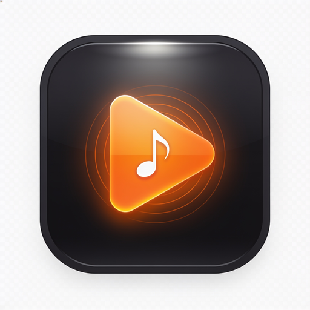
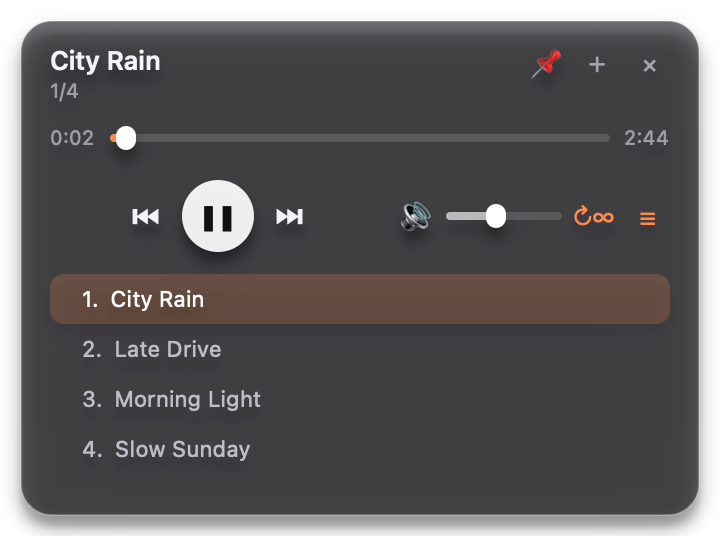
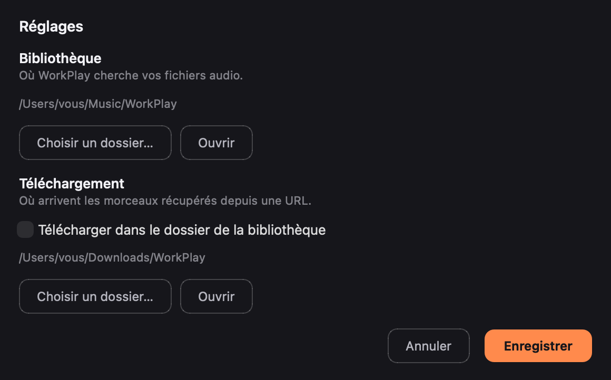
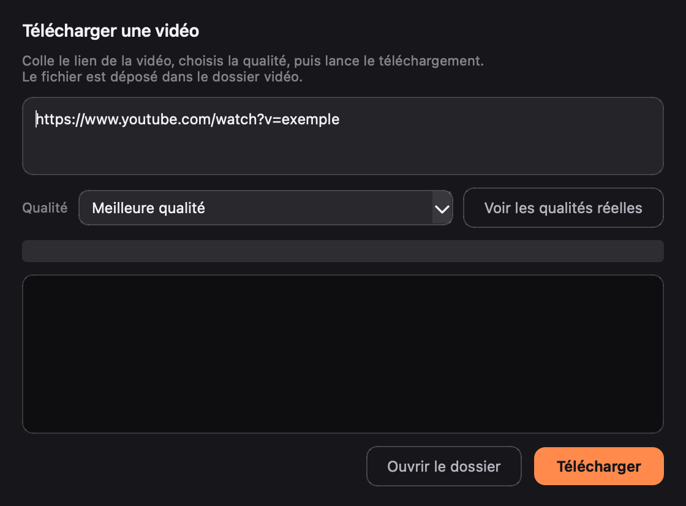

<div align="center">



# WorkPlay

**Un lecteur audio de bureau, discret et toujours à portée de main.**

Widget translucide sans cadre, épinglé au-dessus des autres fenêtres, piloté
depuis la barre de menus macOS — pour écouter sa musique pendant qu'on travaille.



</div>

---

## Pourquoi WorkPlay

Les lecteurs audio classiques prennent une fenêtre entière, une place dans le
Dock et une entrée dans le lecteur d'application. WorkPlay fait le contraire :
une petite carte translucide qui flotte au-dessus de votre travail, ne prend
jamais le focus clavier, et se contrôle depuis la barre de menus. La musique
reste en arrière-plan sans jamais gêner.

Une troisième chose, plus importante : **WorkPlay ne vole jamais le focus**.
L'afficher ne retire pas la frappe de votre éditeur de code ou de votre
terminal, et il ne se remet jamais devant tout seul. Le premier plan est posé
une fois, puis c'est vous qui décidez.

## Fonctionnalités

- **Widget frameless translucide** — coins arrondis, ombre portée, déplaçable à
  la souris ; sa position et son volume sont mémorisés entre deux lancements.
- **Jamais de vol de focus** — c'est une garantie, pas un confort. Le widget
  utilise `WA_ShowWithoutActivating` et n'appelle jamais `activateWindow()` :
  l'afficher ne retire jamais la frappe de l'application au premier plan. Une
  fenêtre qui s'impose au milieu d'une saisie peut faire des dégâts, donc
  WorkPlay ne le fait pas.
- **Toujours au premier plan, mais passif et optionnel** — désactivé par
defaut. L'option existe dans le menu de la barre. WorkPlay ne se remet
**jamais** devant tout seul : aucun mécanisme de ré-assertion périodique. Si
une application plein écran passe devant, un clic sur **Ramener au premier
plan** dans la barre de menus suffit — et ce geste est le vôtre.
- **Icône dans la barre de menus** — afficher/masquer le widget, lancer la
  lecture, ramener au premier plan, ajouter un lien, choisir les dossiers,
  rescanner la playlist, quitter.
- **Playlists nommées** — créez, jouez et gérez des listes. Une playlist ne
  contient que des noms de fichiers : le morceau reste unique dans la
  bibliothèque, et déplacer un fichier rend l'entrée introuvable sans rien
  casser.
- **Répétition** — trois modes : **désactivée** (on s'arrête en fin de liste),
  **morceau** (le titre en cours rejoue en boucle) et **liste** (retour au
  premier morceau). Cycle avec `R`, le bouton ↻ ou le menu. Le mode est
  mémorisé entre deux lancements.
- **Téléchargement vidéo avec choix de la qualité** — collez un lien, choisissez
  la résolution (meilleure, 1080p, 720p, 480p, 360p) ou demandez les qualités
  réellement disponibles sur la source. Le fichier est fusionné en MP4.
- **Fenêtre vidéo** — lecture dans une fenêtre dédiée, avec **plein écran**
  (`F` ou double-clic), **zoom** de 0,5× à 4× (molette ou `+`/`−`),
  **ajustement** (`A`), saut de 5 s avec les flèches, et barre de contrôle qui
  s'efface en plein écran. L'image n'est jamais rognée : elle est centrée avec
  des bandes noires si les proportions diffèrent.
- **Réglages** — un panneau dédié pour choisir le dossier de la
  bibliothèque et, séparément, le dossier où atterrissent les téléchargements.
  Si les deux diffèrent, les morceaux récupérés rejoignent automatiquement la
  bibliothèque (sans jamais écraser un fichier existant).
- **Téléchargement intégré** — collez une ou plusieurs URLs YouTube dans la
  fenêtre « Ajouter des morceaux » : elles sont converties en MP3 (avec pochette
  et métadonnées) et rejoignent la playlist sans redémarrer le lecteur. Un clic
  sur **Ajouter le lien du presse-papiers** récupère directement un lien copié.
- **Playlist locale** — lecture automatique enchaînée, double-clic pour jouer un
  titre, rechargement à chaud quand des fichiers apparaissent dans le dossier.
- **Aucune connexion réseau** en dehors des téléchargements que vous demandez
  explicitement. Pas de télémétrie, pas de compte, pas de publicité.
- **Auto-test intégré** — 46 vérifications instrumentées des contrôles, du
  tray, de l'absence de vol de focus, des playlists, des modes de répétition,
  des réglages, de la fenêtre vidéo, du codec produit et du téléchargement
  réel.

## Installation

### Téléchargement

Une version signée et **notarisée** par Apple est publiée dans les
[releases](https://github.com/ssakone/workplay/releases) :

- `WorkPlay-1.0.0.dmg` — à monter, puis glisser WorkPlay dans Applications
- `WorkPlay-1.0.0.zip` — archive de l'application

Le ticket de notarisation étant agrafé, l'application s'ouvre par un simple
double-clic, sans avertissement de Gatekeeper.

### Depuis les sources (recommandé)

Prérequis : **macOS**, **Python 3.10+**, et pour le téléchargement
`yt-dlp` + `ffmpeg` :

```bash
brew install yt-dlp ffmpeg
```

Puis :

```bash
git clone https://github.com/ssakone/workplay.git
cd workplay

python3 -m venv .venv
./.venv/bin/pip install -r requirements.txt

./.venv/bin/python app.py
```

Au premier lancement, WorkPlay crée le dossier `~/Music/WorkPlay` s'il n'existe
pas. Déposez-y vos fichiers audio, ou ajoutez des morceaux par URL depuis la
barre de menus.

### Construire le bundle `.app`

```bash
./.venv/bin/pip install -r requirements-dev.txt
./tools/build.sh                      # bundle signé adhoc (~120 Mo)
./tools/build.sh "Apple Development: Votre Nom (TEAMID)"   # avec une identité
```

> **Note Gatekeeper** — sans certificat *Developer ID* payant, macOS refuse
> l'ouverture par double-clic d'un bundle signé adhoc. Contournement :
> clic droit → **Ouvrir**, ou
> `xattr -d com.apple.quarantine "dist/WorkPlay.app"`.

### Signer pour la distribution et notariser

Pour produire un bundle que n'importe qui peut ouvrir sans avertissement, il
faut un certificat **Developer ID Application** et une clé API App Store
Connect.

```bash
cp .env.local.example .env.local    # renseigne les chemins et identifiants
./tools/sign-keychain.sh create     # trousseau temporaire avec le certificat
./tools/release.sh 1.0.0            # signature, notarisation, DMG, ZIP
./tools/sign-keychain.sh destroy    # nettoyage
```

`release.sh` enchaîne : signature Developer ID du bundle, soumission à Apple et
attente du verdict, agrafage du ticket, fabrication du DMG, nouvelle
notarisation du DMG, empreintes SHA-256, et enfin une évaluation Gatekeeper qui
**échoue si l'application n'est pas acceptée**.

Le certificat est importé dans un trousseau dédié (`workplay-signing.keychain-db`)
plutôt que dans votre trousseau de session : l'opération est jetable et
n'altère rien de votre configuration.

Aucun identifiant Apple n'est stocké dans le dépôt : tout passe par
`.env.local`, ignoré par git.



### Télécharger une vidéo



## Utilisation

| Geste | Effet |
|---|---|
| Glisser la fenêtre | La déplace (position mémorisée) |
| **Espace** | Lecture / Pause |
| **←** / **→** | Piste précédente / suivante |
| **↑** / **↓** | Volume ± 5 % |
| **L** | Afficher / masquer la playlist |
| **R** | Changer de mode de répétition |
| **Échap** | Replier la playlist, puis masquer le widget |
| Double-clic sur le widget | Lecture / Pause |
| Double-clic dans la liste | Jouer ce morceau |
| Clic sur la barre | Se déplacer dans le morceau |
| ✕ | Quitter |
| Clic sur l'icône du menu | Afficher / masquer le widget |

Les morceaux s'enchaînent automatiquement en fin de piste.

### Ajouter de la musique par URL

Barre de menus → **Ajouter des morceaux par URL…** — collez une ou plusieurs
URLs (une par ligne). Le téléchargement s'exécute en file d'attente : vous
pouvez en ajouter d'autres pendant qu'un lot tourne. Les nouveaux fichiers sont
intégrés à la playlist dès la fin du téléchargement.

Plus rapide encore : copiez le lien de la vidéo, puis barre de menus →
**Ajouter le lien du presse-papiers** — le champ est pré-rempli, il ne reste
qu'à valider.

### Choisir les dossiers

Barre de menus → **Réglages…** :

- **Bibliothèque** — le dossier que WorkPlay lit et affiche.
- **Téléchargement** — où les morceaux récupérés sont écrits. Cochez
  *Télécharger dans le dossier de la bibliothèque* pour n'en avoir qu'un seul.

Si les deux dossiers diffèrent, chaque morceau téléchargé est déplacé vers la
bibliothèque à la fin du lot, afin d'apparaître dans la playlist. Un fichier du
même nom déjà présent n'est jamais écrasé : le doublon est ignoré et signalé
dans le journal du dialogue.

Au lancement, on peut aussi pointer un dossier :

```bash
WORKPLAY_DIR=~/Musique/MaCollection ./.venv/bin/python app.py
```

Extensions reconnues : `mp3`, `m4a`, `aac`, `wav`, `flac`, `ogg`, `opus`, `webm`.

### Playlists

Barre de menus → **Nouvelle playlist…** pour en créer une vide, ou
**Enregistrer la liste affichée…** pour figer la liste en cours.

Le sous-menu **Jouer une playlist** liste vos playlists et permet de revenir à
**Toute la bibliothèque**. Le morceau en cours peut être ajouté à une playlist
existante, ou retiré d'une playlist.

Les playlists vivent dans
`~/Library/Application Support/WorkPlay/playlists/`, en JSON lisible :

```json
{
  "name": "Mes hits",
  "tracks": ["NAMADINGO - AMBU.mp3", "Namadingo - Na.mp3"]
}
```

### Répétition

Trois modes, cyclés par le bouton ↻ du widget, la touche `R` ou le menu :

| Mode | Comportement en fin de morceau |
|---|---|
| **↻ désactivée** | On s'arrête en fin de liste |
| **↻1 morceau** | Le titre en cours rejoue indéfiniment |
| **↻∞ liste** | Retour au premier morceau (boucle) |

Un geste manuel (bouton suivant, flèche `→`) reste toujours possible : seul le
comportement en fin de liste change.

### Regarder une vidéo

Barre de menus → **Télécharger une vidéo…** : collez un lien, choisissez la
qualité, puis **Télécharger**. Le bouton **Voir les qualités réelles**
interroge la source et affiche les résolutions disponibles avant de choisir.

Dès que le téléchargement est terminé, la fenêtre vidéo s'ouvre.

| Geste | Effet |
|---|---|
| **F** ou double-clic | Plein écran aller/retour |
| Molette, **+** / **−** | Agrandir / réduire la fenêtre (0,5× à 4×) |
| **A** | Revenir à l'ajustement |
| **Espace** | Lecture / Pause |
| **←** / **→** | Reculer / avancer de 5 s |
| **Échap** | Quitter le plein écran, puis fermer |

Barre de menus → **Ouvrir une vidéo…** pour revoir un fichier déjà téléchargé
(dossier par défaut `~/Movies/WorkPlay`).

## Configuration
| Variable d'environnement | Effet |
|---|---|
| `WORKPLAY_DIR` | Dossier musical (prioritaire sur le choix mémorisé) |
| `WORKPLAY_DEBUG=1` | Trace la géométrie, l'état de lecture et l'épinglage |
| `WORKPLAY_SELFTEST=1` | Lance l'auto-test et affiche le rapport, puis quitte |
| `WORKPLAY_TEST_URL` | URL utilisée par le test de téléchargement réel |

Ordre de priorité pour le dossier musical : `WORKPLAY_DIR` > dossier choisi dans
l'interface (mémorisé via `QSettings`) > `~/Music/WorkPlay`.

### Auto-test

```bash
WORKPLAY_SELFTEST=1 WORKPLAY_TEST_URL="https://www.youtube.com/watch?v=..." \
  ./.venv/bin/python app.py
```

Le rapport couvre la playlist, la lecture, les contrôles de transport, le
volume, la barre de progression, le premier plan, l'absence de vol de focus, le
tray, le changement de dossier, le codec vidéo produit (décodable par Qt), le
zoom sans rognage, et deux téléchargements réels dans des dossiers temporaires.

## Architecture

```
workplay/
├── app.py                  application complète (widget + tray + téléchargement)
├── workplay.spec           spécification PyInstaller
├── requirements.txt        dépendances d'exécution
├── requirements-dev.txt    dépendances de construction
├── assets/
│   ├── AppIcon.icns        icône du bundle
│   ├── logo.png            logo (README)
│   ├── screenshot.png      capture du widget
│   ├── settings.png        capture du panneau de réglages
│   ├── video.png           capture du téléchargement vidéo
│   └── entitlements.plist  entitlements de signature macOS
└── tools/
    ├── build.sh            build + signature du .app
    ├── release.sh          signature Developer ID, notarisation, DMG
    ├── sign-keychain.sh    trousseau temporaire pour la signature
    └── make_icns.py        génère le .icns depuis une image carrée
```

Tout tient dans un seul fichier `app.py` : la logique de lecture, le widget, le
menu de la barre de menus et le dialogue de téléchargement. Aucun framework
au-delà de PySide6.

## Choix techniques

- **PySide6 (Qt 6) plutôt qu'Electron.** Un widget de cette taille n'a pas
  besoin d'un moteur de navigateur complet : le bundle pèse ~120 Mo contre
  ~300 Mo, et surtout ~40 Mo de RAM contre ~150 Mo pour un processus qui reste
  ouvert toute la journée. Le frameless translucide avec ombre portée est natif
  en Qt ; sous Electron, la transparence de fenêtre sous macOS est notoirement
  fragile sur les bords.
- **PyInstaller** pour l'empaquetage, avec une liste d'exclusions agressive :
  sans elle, PySide6 embarque WebEngine, QML et la pile 3D — plusieurs centaines
  de Mo inutiles pour lire un MP3.
- **Hardened runtime + entitlements.** `disable-library-validation` est requis
  car Python.framework et Qt chargent des `.dylib` depuis `Resources/` ; sans
  cette exception, la signature est rejetée au lancement.
- **`yt-dlp` en sous-processus** plutôt qu'en bibliothèque : l'outil en ligne de
  commande est plus simple à mettre à jour (les sites changent souvent) et sa
  progression est directement lisible sur sa sortie standard.
- **Notarisation avec agrafage du ticket.** La soumission seule ne suffit pas :
  sans `stapler staple`, la vérification Gatekeeper exige une connexion réseau
  au premier lancement. Le ticket agrafé rend l'application ouvrable hors ligne.

## Limitations connues

- macOS uniquement (le tray, la translucidité et la signature sont spécifiques).
- Si une application passe en plein écran, le widget peut se retrouver
derrière : un clic sur **Ramener au premier plan** le replace. C'est
volontaire — la correction automatique exigerait de reprendre le focus, ce
que WorkPlay s'interdit.
- Le téléchargement YouTube dépend de `yt-dlp` ; si YouTube change, il faut
  mettre l'outil à jour (`brew upgrade yt-dlp`).

## Licence

[MIT](LICENSE).

---

<div align="center">

### Le logo


### L'interface


### Les réglages


</div>
